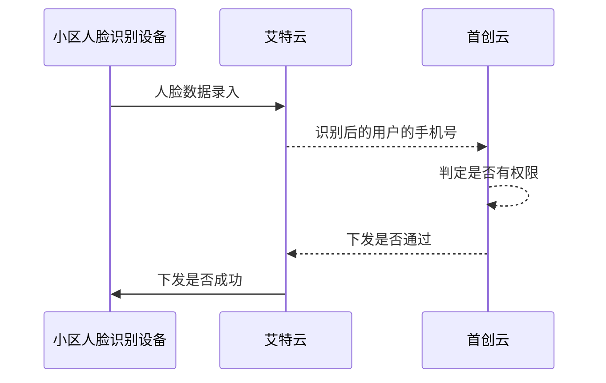

# 首创二期关键流程设计

## 人脸基础数据录入流程

## 人脸识别开锁流程

```mermaid
sequenceDiagram
  participant 小区人脸识别设备
  participant 艾特云
  participant 首创云
  小区人脸识别设备->>艾特云: 人脸数据录入
  艾特云-->>首创云: 识别后的用户的手机号
  首创云-->>首创云: 判定是否有权限
  首创云-->>艾特云: 下发是否通过
  艾特云->>小区人脸识别设备: 下发是否成功
```
